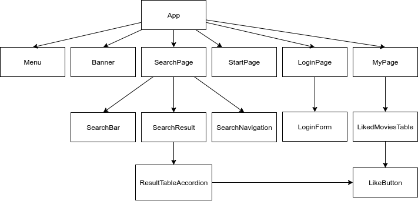

# Prosjekt 3 Gruppe 22

## Generelt
For å starte prosjektet: klon repoet lokalt og kjør npm install og npm start i client mappen. 

### Komponenthierarki
Følgende diagram viser hvordan komponentene våre henger sammen:


## Krav til innhold + funksjonalitet

Vi har laget en nettside med React og Typescript ved bruk av IMDB sitt datasett av filmer. Det er en søkeside hvor man kan søke blant alle filmene i datasettet som er på 7.2 millioner datapunkter. Grunnen til at vi valgte å gjøre dette er fordi det er et open-source datasett som er veldig stort og var derfor tilstrekkelig til å vise faktisk funksjonalitet på siden. 

På nettsiden har man en homepage som man kommer automatisk til når man åpner siden. Her står det kort forklart hvordan man brukes siden og hva slags side det er. Når man ikke er logget inn, har man bare tilgang til homepage, searchpage. Er man logget inn får man også tilgang til mypage og man kan like filmer.

Input av søk gjør man ved hjelp av et tekstlig søk input, men man kan også filtrere søket ved hjelp av noen parameter.

###  Søkemulighet
#### Enkelt søk
Sortering og filtrering skjer i databasen basert på spørring via REST-API.
Spørringen bygges i henhold til input-feltene på søkesiden.

#### Avansert søk
Man kan også få mer avanserte søk enn bare tekst input, ved at det er flere parameterer man kan filtre på i tillegg til bare tekst.
### Søkeresultat
#### Funksjonalitet
Når man laster inn alle resultatet fra et søk får man lastet inn de 20 første resultatene på siden også kan man bla seg videre nederst på siden for å laste inn flere resultatet. Man kan også trykke på hvert enkelt objekt å få opp mer informasjon, sånn som kravene sa. Vi har også en navigasjonsbar nederst på siden hvor man kan bla seg videre i resultatene.
#### Listevisning
 Vi valgte også og bruke en tabell til å vise informasjonen da dette var ryddig og oversiktlig, i tillegg til at det ga oss mulighet til å vise mer enn bare tittel på det vi lastet inn. Listevisningen genereres i ResultTableAccordion, som får inn en liste filmer fra forelderen sin SearchResult.

Filmattributtene som vises i Listevisning er Name, Type, Year, Genre og Liked.
#### Detaljert visning
Radene i resultattabellen kan trykkes på. Da vises en ny rad med en Table med flere av filmens attributter.

Vi har altså en en Table inni et Accordion inni en Table.
Ved “Accordion inni Table” havner alt innholdet i den skjulte raden i samme celle. Dette ser ikke pent ut. Vi har jobbet mye med å prøve å fikse det, uten hell.
Sett i ettertid ville det vært raskere å lage et “hjemmelaget trekkspill” av Table, der noen rader er usynlige til raden over blir klikket. Dette kunne blitt styrt ved onClick og endring av de skjulte radenes klasser. Etterpåklokskap, der altså.

#### Sider
For å unngå å spørre om for store datasett, har vi delt spørringene opp i sider.
Hver side består av inntil 20 søkeresultater.
Hvis det ikke finnes resultater, vises en tom liste.

#### Utfordringer
Da datasettet vårt er veldig stort, og den virtuelle serveren har begrensede ressurser, kan enkelte spørringer ta lang tid ( mer enn 30s).

Et eksempel på et treigt søk er “fuglane” som søker gjennom 7,5mill filmer for å returnere en enkelt film.

### Brukergenererte data
#### Dataene og lagring
Når denne funksjonen kalles i klienten av LikeButton:
```typescript
HttpClient.likeMovie(movieID, username);
```
, kjøres denne spørringen på serveren:
```sql
INSERT INTO title_likes VALUES (username, movieID);
```

Hvis man ikke er logget inn og prøver å like en film, får serveren en feilmelding.
#### Innlogging
Man kan opprette bruker ved å skrive hvilket som helst tekststreng i brukernavnfeltet, inkludert “”. Deretter kan man like filmer og finne alle sine likte filmer på mypage. Dette lagres i databasen, og hvis man logger seg ut og inn igjen med samme brukernavn er de likte filmene fortsatt tilgjengelig.

Vi har valgt å gjøre dette fordi det var en enkel måte og håndtere brukergenerert data og lagre det i databasen. Siden det ikke var krav om det har vi ikke lagt inn noe form for brukerautentisering eller krav til hva brukernavnet må være.

#### Visning av likte filmer - My Page
Dersom en bruker er logget inn kan man nå en “My Page” som viser en tabell over alle filmene denne brukeren har likt.
Tabellen (LikedMoviesTable) er bygget ganske likt som ResultTableAccordion, og spør databasen etter ‘getLikedMovies(username).


### Database
Vi har posgreSQL med  åpne datasett fra IMDb.

## Teknologi
### React

Vi har brukt create-react-app til å sette opp prosjektet, og hele prosjektet er skrevet i Typescript. Dette var veldig i greit i dette prosjektet da hele gruppen var mye mer komfortable med react i dette prosjektet enn forrige.
### Redux
Vi har valgt å bruke redux til å implementere state håndtering på om noen er logget inn eller ikke, og ut i fra det endre hvilken komponenter som skal vises. Det er nok ikke egentlig nødvendig å bruke redux i et prosjekt som dette, da det er ganske komplisert å sette seg inn, men det var fint å gjøre for læringen. Det var også veldig greit å ha når vi hadde fått konfigurert alt sammen, da det er en del ulike komponenter som ser på om isLoggedin = true/false. 

Vi hadde bare en reucer og to actions, logg inn/logg ut. Når vi testet prosjektet helt på slutten oppdaget vi en feil, hvor det vi har i reducer filen endret direkte på state som skal være immutable. Dette vet vi er veldig dårlig practice, men siden vi oppdaget dette såpass sent lot vi det være i prosjektet, men nevner her i dokumentasjonen at dette er noe vi vet.

#### Kode-eksempel
Dette eksempletet viser hvordan man i et komponent kan sette opp og bruke actions fra redux og hvordan man henter ut data.

```typescript
const ReduxExampleComponent = () => {
  const dispatch = useDispatch();
  const isLoggedIn = useSelector((state: RootStateOrAny) => state.loggedIn);

  const handleSubmit = () => {
    dispatch(logIn(userInput));
  };
}
```
### restAPI
Vi har et REST API laget med Node, Typescript, Express og postgreSQL.

Vi har valgt å bruke Postgresql og Express som backend. Postgresql ble valgt fordi vi er kjent med relational databases (relasjonsdatabaser) fra TDT4145.

Serveren er dokumentert i  `/server/README.md`.

The main module used to communicate with the rest server is found in
`/client/src/modules/HttpClient.ts`.
The module uses the npm package `node-fetch` to send requests to the server.

The client module defines a set of generic functions which are used to build
more specific ones.
```typescript
public get<T>(url: string): Promise<T | null> {
	return fetch(url, { method: "GET" })
		.then((res) => res.json())
		.then((res) => {
			return res as T;
		})
		.catch((error) => {
			console.error(error);
			return null;
		});
}
```
The return type `Promise` is an object
that represents the eventual completion (or failure) of an asynchronous
operation.

### Tredjeparts komponenter/bibliotek
Vi har brukt biblioteket semantic-ui og redux bibliotekene til utviklingen av siden vår. For informasjon om redux se tidligere (eget) avsnitt.

Serveren bruker biblioteket Express, som er et rammeverk for å lage web-løsninger.
Klienten bruker biblioteket node-fetch for å sende spørringer til serveren.

#### Semantic-ui
Vi har brukt komponentbiblioteket react.semantic-ui som base til en del av komponentene på siden vår.
Komponenter vi har brukt er:

Komponent | Bruksområde | Brukskomponent |
--------- | ----------- |---------------
Table | Til visning av søkeresultat og innhold i detaljert visning. | ResultTableAccordion
Accordion | Til å skjule/vise deler av innhold i søkeresultat og avansert søk | ResultTableAccordion, SearchBar
Form | Til å samle skjema-elementer i “avansert søk” | SearchBar
Button | Til å lage like-button med ikon inni | LikeButton
Ikon | For å få hjerte på like-knapp | LikeButton
Loader | Til å vise at det ventes på resultat fra databasen | SearchResult


Vi har også brukt semantic-ui-css til grunnleggende styling av disse elementene. I noen tilfeller er stylingen erstattet med egenlaget styling, som i LikeButton. Se filen “src/scss/_button.scss” for eksempel.

##### Problemer
Gjennom semantic-ui-komponentene får vi ikke til å sette alle attributtene til html-elementene som genereres. Dette gjelder spesielt tabIndex, noe som kompliserer den universelle utfordringen av siden.

Semantic-ui-css har responsiv styling av elementer, men denne tilsvarer i en del tilfeller ikke det vi ønsker skal skje med elementet. Det er for eksempel upraktisk at rader i tabeller kollapser til enkeltceller på små skjermer, og at Accordion ikke lenger skjuler innholdet sitt.
Dette kunne vi overskrevet med litt arbeid, men dette ble nedprioritert for viktigere arbeid som implementering av “likes” på filmer.
#### Scss
Vi har brukt sass-css-bybridformatet scss til styling av sida. Dette er et filformat som kompileres til css ved "npx sass --watch src/scss:src/css". Notasjonen i scss støtter css-syntaks, men har noen tilleggselementer. Eksempler på dette er nøsting av selectors, importering av "delfiler" og muligheten til å definere og gjenbruke konstanter. Vi synes scss har gjort styling-koden vår ryddigere, fordi vi enkelt kan trekke ut kode som gjelder enkeltkomponenter i egne filer. Det har også vert en fordel å ha definerte color-konstanter, da dette gjør det lett å holde styr på ulike nyanser i fargetemaet, og i tilleg gjør det enkelt å oppdatere fargene på hele siden. Nøstede seclectors gjør at vi slipper repetere selectors når vi skal nå barna deres. Dette medvirker også i våre øyne til ryddigere stylingkode.

Ved vurdering av prosjektet vårt vil det være mer oversiktlig å lese stylingkoden i src/scss enn den i src/css/App.css, da førsnevnte er delt opp i delfiler og generelt har flere kommentarer. ("//"-kommentarer er brukt i scss men er ikke lov i css, og forsvinner derfor ved kompilering.)
##### Eksempel på bruk av scss:
###### SCSS-kode
App.scss
```scss
/* "App.scss", main styling file */
@import "colors";   // importing file with color theme

body {    // Styling <body>
  background-color: $background-color;
  
  h1 {    // Styling <h1>'s inside <body>
    color: $text-color;
  }
}
```
_colors.scss
```scss
/* "_colors.scss", file for color theme */
// Defining colors
$background-color: red;
$text-color: blue;
```
###### CSS-kode
Dette kompilerer denne CSS-koden i App.css:
```css

/* "App.scss", main styling file */
/* "_colors.scss", file for color theme */

body {
  background-color: $background-color;
  
}
body h1 {
    color: $text-color;
  }
```

## Testing

### Enhetstesting

Til enhetstesting bruker vi Jest og enzyme for å teste komponentene. Det er noen få tester som sjekker om App og Menu renderer som de skal, i tillegg til en test for om initial state er riktig i redux. Dette er de tre statene som “Pass”, i tillegg har vi skrevet to tester som sjekker login, logout reducer, men de failer fordi vi endrer state direkte som man ikke skal gjøre. Dette viser at testingen fungerer, men siden vi ikke ville brekke hele prosjektet og oppdaget dette da vi skrev testene 3 timer før innleveringsfristen, valgte vi og la det være som ett eksempel på tester som fungerer, selv om de kaster en feilmld.

Vi har også i dette prosjektet, som i tidligere prosjekter gjort manuell testing av responsivitet og design ved hjelp av verktøyene som er innebygd i chrome, og manuell testing på ulike browsers og skjermstørrelser.

### End-to-end-testing

Vi hadde tenkt å bruke cypress til å drive automatisert end-2-end testing i dette prosjektet, men kom aldri så langt dessverre. Det viste seg og være mer oppsett enn vi forventet, så vi valgte og gjøre andre aspekter av prosjektet bra, og ikke to ting halvdårlig. Vi skrev derimot en del testhistorier som vi hadde tenkt å bruke for å gjennomføre automatisert testing. Vi kunne derimot bare fått gjennomført manuell end-2-end testing.

Her er eksempel på to testhistore:
Test1: bruker skal kunne logge inn
trykk på “log inn”-knappen
	kom til login-sida (se teksten “log in” og “password”
Skriv inn brukernamn i felt med placeholder “Ola Nordmann”
trykk login
	sjekk at ein får beskjeden “You have been logged in”  og får “brukernamn” ein eller anna plass på sida (helst i header)
	sjekk at “logg inn” er bytta med “logg ut”

Test2: bruker skal kunne logge ut
sjekk at “log out”-knappen finnes, og at ein er logga inn (gjenbruk fra forrige test)
trykk på “log out”-knappen
	sjekk at ein ikkje er logga inn: finn ikkje “brukernamn” på sida.
	sjekk at det no står “log in” på knappen


### Mangler og erfaringer
Vi lærte ikke helt fra forrige prosjekt og startet alt for sent med tester, i tillegg til at vi undervurderte hvor mye det var å sette seg inn i. Dette førte til at veldig mye tid gikk til prøving og feiling og lesing av dokumentasjonen. Selv om vi ikke har fått gjennomført så grundig testing som vi skulle ønske, og store deler av det som er viktig med enhetstesting, nemlig god testing av funksjoner, mangler, har vi fortsatt økt kompetanse nivået i gruppen.
Vi er dermed ikke fornøyde med hvor mye enhetstesting vi har fått gjennomført, men tar med oss mye god lærdommen om å skrive tester samtidig som man utvikler til neste prosjekt.

## Git

### Issues i Gitlab
Ved oppstarten av prosjektet gikk vi gjennom oppgaven og delte den opp i Issues. Disse har vi både på Gitlab, og i et eksternt “backlog”-dokument (ref. SCRUM). Først deler vi issuene inn i gruppene (labels i Gitlab) etter “viktig”, “medium” og “bonus”.
	“viktig” - Krav i oppgaven, og/eller andre Issues er avhengig av at dette blir gjennomført
	“medium” - Avhengig av andre (viktigere) issues. Om ikke alle “viktig”-issues blir fullført kuttes det i “medium”
	“bonus” - ting som ikke er gitt (eller viktig) i oppgaven, men som vil forbedre siden. Tildeles sist.
Så prioriterer vi issues innenfor en kategori, fra høyest til lavest prioritet. Så langt det er mulig skal issues utføres i prioritert rekkefølge.
### Endringer fra forrige gang
På forrige prosjekt jobbet vi i lokale branches der vi pullet master, fikset konflikter og så pushet. Vi ble oppfordret i medstudentvurderingen til å i større grad bruke branches, og endret derfor arbeidsflyten vår til dette prosjektet.

De fleste issues har blitt utviklet på egen branch, som så er merget til master eller en “foreldre-branch”. Unntaket er issues som “#1 setup” og “#2 grunnomriss av siden”, disse ble utført før vi fikk studenttilbakemeldingen.
### Fordeler

Fordelen med dette er at vi har jobbet i branches i dette prosjektet, og man kan opprette branches rett fra issues i gitlab. Dette gjør det veldig enkelt og ha branches med fornuftig navnekonvensjon og ferdig sortert. Det var veldig lærerikt og bruke branches ordentlig, og gruppa synes det i stor grad var en positiv endring, men det er fortsatt rom for forbedringer. Det ville nok gått helt fint og jobbe i en master branch, da dette ikke var et kjempe stort prosjekt, men vi er fornøyd med å lært en ny måte å bruke git på. Det var også psotivt for gruppen at vi måtte gå godkjennes hverandres mergerequest, og derfor fikk en bredere forståelse for kodebasen.  
### Utfordringer

Utfordringen var at det lett ble en mismatch mellom hva som var lokalt på PCen og hva som var status på gitlab. Det var også ikke optimalt syntes vi at man ikke kunne fikse mergekonflikter lokalt før man pushet til master, da dette var litt enklere. Det er også enklere og miste oversikt over hvilken branch man egt skal jobbe i og pushe feil, noe som kan føre til mye rot. Neste gang skal vi alltid pulle origin master før vi lager merge request, så vi er helt sikre på at master ikke kræsjer når vi merger.

## Samarbeid
Ved starten av forrige prosjekt hadde bare en på gruppa kjennskap til React. Denne gangen har alle et bedre grunnlag, som gjør oppstarten mer effektiv enn sist gang.
Vi har valgt at en annen person enn sist gang skal sette opp prosjektet og lage grunnstruktur  for siden, slik at flest mulig får prøve seg på det. 

Fra starten av la vi en plan med issues om prioritering av kravene i oppgaven, der enkel innlogging, database (og kommunikasjon med denne), samt søkefunksjonen ble prioritert øverst. Ting som detaljert visning og lagring av søk kommer i andre rekke, fordi vi denne gangen heller vil gjøre deler av oppgaven grundig enn å skrape i overflaten på flere tema.

## Kilder
https://css-tricks.com/snippets/css/complete-guide-grid/ (“css-grid-bibelen”)\
https://developer.mozilla.org/en-US/docs/Web/Accessibility/Understanding_WCAG/Keyboard (om tilgjengelighet og :focus)\
https://medium.com/javascript-in-plain-english/i-tested-a-react-app-with-jest-testing-library-and-cypress-here-are-the-differences-3192eae03850 (Artikkel om ulike typer testing)\
https://www.w3.org/TR/WCAG20/ (Universell utforming-bibel)\
https://www.youtube.com/watch?v=_yOZROiR7s0 (how to semantic-ui)\
https://react.semantic-ui.com/usage (setup av semantic-ui)\
https://stackoverflow.com/questions/53240115/semantic-ui-react-map-accordion-in-every-table-row (semantic-ui-table med accordion)\
https://react.semantic-ui.com/modules/accordion/#advanced-menu (accordion-bruksanvisning semantic-ui)\
https://react.semantic-ui.com/collections/table/#variations-selectable-row (table-bruksanvisning semantic-ui)\
https://reactjs.org/docs/forms.html (Controlled Components for forms i React)\
https://stackoverflow.com/a/53313430 (Få komponent til å kjøre funksjon ved endringer i state til foreldrekomponent)\
https://reactjs.org/docs/hooks-state.html (hooks i funksjonelle komponenter)\
https://www.digitalocean.com/community/tutorials/react-testing-react-components (testing av react komponenter med Jest)\
https://redux.js.org/recipes/writing-tests (testing av Redux med jest)\

