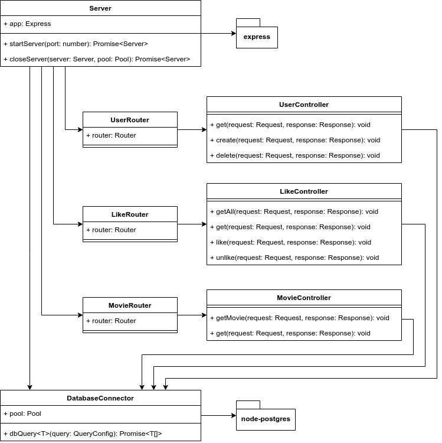

# REST Server

## Technologies

The server is implemented using node, typescript, express and postgreSQL.

### Express

Express is light-weight web application framework.

### PostgreSQL

PostgreSQL is an object-relational database.

Our data is stored in three tables:

* `title_basics`: Contains basic information on titles (movies etc.)
* `users`: Contains users
* `title_likes`: Contains what titles users like.

The SQL for the tables is found in `/server/sql`

## Code Structure

The server is split into different modules:

* Server - Configures and initiates the express app.
* Routers - Handles what controller to use based on URI.
* Controllers - Connects to the database and does logic.
* DatabaseConnector - Configures the connection to the database
  and provides a query method.

The following diagram describes the outline of the code structure:



## REST API

A failed request has response code 400 Bad Request
and the body contains an error message.

### `GET /movie`

Searches for movies.

Possible parameters are:

* `title` - title of the movies contains this case insensitive string
* `titleType` - one of `{movie, tvMovie, short, tvMiniSeries, tvSeries}`
* `minYear` - minimum starting year inclusive
* `maxYear` - maximum starting year inclusive
* `orderBy` - one of `{title_type, primary_title, start_year}`
* `orederDir` - either `ASC` for ascending order or `DESC` for descending order

If supplied with a username as a parameter,
the `liked` field if true if said user has liked the movie
or false if they have not liked it.
If username is not supplied, `liked` is always false.

E.g.
Search for all movies with a title containing "Black",
between the years 2000 and 2010,
of the type movie,
ordered by title ascending
and include liked status for user foo.

`/movie?title=Black&titleType=movie&minYear=2000&maxYear=2010&orderBy=primary_title&orderDir=ASC&username=foo`

A successful response has a body with the following structure:

```json
[
  {
    "tconst": string,
    "title_type": string,
    "primary_title": string,
    "original_title": string,
    "is_adult": boolean,
    "start_year": number,
    "end_year": number,
    "runtime_minutes": number,
    "genres": string
    "liked": boolean
  }
]
```

### `GET /movie/:movieId`

Gets a specific move identified by `movieId`.

If supplied with a username as a parameter,
the `liked` field if true if said user has liked the movie
or false if they have not liked it.
If username is not supplied, `liked` is always false.

E.g.
```
GET /movie/tt9655334?username=foo
```

If the movie is not found, the response has response code 404 Not Found.

A successful response has a body with the following structure:

```json
[
  {
    "tconst": string,
    "title_type": string,
    "primary_title": string,
    "original_title": string,
    "is_adult": boolean,
    "start_year": number,
    "end_year": number,
    "runtime_minutes": number,
    "genres": string,
    "liked": boolean
  }
]
```

### `GET /user/:userId`

Gets a user.
The response has response code 404 if the user does not exist.

A successful response has a body with the following structure:

```json
[
  {
    "username": string
  }
]
```

### `PUT /user/:userId`

Attempts to create a user.
The response has response code 404 Not Found if the user does not exist,
and response code 409 Conflict if the user already exists.

A successful response has a body with the following structure:

```json
[
  {
    "username": string
  }
]
```

### `DELETE /user/:userId`

Attempts to delete a user.
The response has response code 404 Not Found if the user does not exist.

A successful response has a body with the following structure:

```json
[
  {
    "username": string
  }
]
```

### `GET /user/:userId/likedMovies/`

Gets all movies liked by the given user.
The response has response code 404 Not Found if the user does not exist.

A successful response has a body with the following structure:

```json
[
  {
    "tconst": string,
    "title_type": string,
    "primary_title": string,
    "original_title": string,
    "is_adult": boolean,
    "start_year": number,
    "end_year": number,
    "runtime_minutes": number,
    "genres": string
    "liked": boolean
  }
]
```

### `GET /user/:userId/likedMovies/:movieId`

Gets the liked status of a movie for a user.
The response has response code 404 Not Found if the user does not exist.

A successful response has a body with the following structure:

```json
[
  {
    "liked": boolean
  }
]
```

### `PUT /user/:userId/likedMovies/:movieId`

Likes a movie for a user.
The response has response code 404 Not Found if the user does not exist.

A successful response has a body with the following structure:

```json
[
  {
    "liked": boolean
  }
]
```

### `DELETE /user/:userId/likedMovies/:movieId`

Unlikes a movie for a user.
The response has response code 404 Not Found if the user does not exist.

A successful response has a body with the following structure:

```json
[
  {
    "liked": boolean
  }
]
```

## Testing

## Sources
* [node-postgres documentation](https://node-postgres.com/)
* [express documentation](https://expressjs.com/en/4x/api.html)
* [Setup tutorial for express and postgresql](https://medium.com/nsoft/building-and-running-nodejs-typescript-postgresql-application-with-docker-3878240a2f73)
* [Dataset from IMDb](https://www.imdb.com/interfaces/)
* [JEST Expect Documentation](https://jestjs.io/docs/en/expect)
